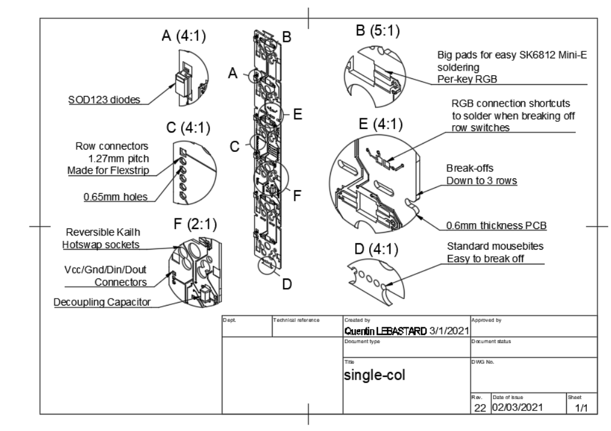

## Dactyl single-col PCB

By Quentin LEBASTARD

https://bastardkb.com/

## Features

- Made for Dactyl Manuform
- Will work with other 3d keyboards as long as the switch spacing is the same

TODO
- SOD123 diodes
- SK6812 mini-e leds
- capacitors
- 1.27mm pitch flexstrip

## License

This work is licensed under a Creative Commons Attribution-NonCommercial-ShareAlike 4.0 International License.